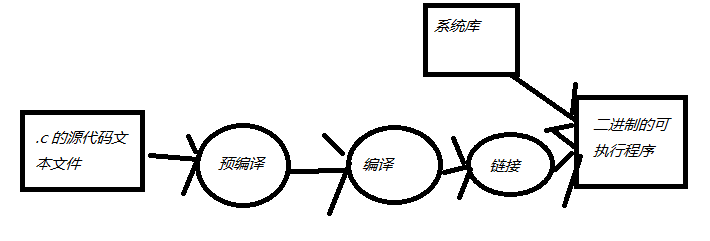

file

```
NAME
     file -- determine file type

SYNOPSIS
     file [-bcEhiklLNnprsvz0] [--apple] [--mime-encoding] [--mime-type]
          [-e testname] [-F separator] [-f namefile] [-m magicfiles]
          [-P name=value] file ...
     file -C [-m magicfiles]
     file [--help]
```


Linux编译后的可执行程序只能在linux运行，windows编译后的程序只能在windows下运行

64位的linux编译后的程序只能在64位linux下运行，32位linux编译后的程序只能在32位的linux运行。

64位的windows编译后的程序只能在64位windows下运行，32位windows编译后的程序可以在64位的windows运行。


\#include <文件名>,如果文件在系统目录下，那么需要用<>

\#include “文件名”,如果文件在当前目录下，那么用”“


main函数又叫主函数，main函数是c语言程序的入口，程序是从main函数开始执行的，一个c语言程序中只能有一个main函数，

c语言可执行程序必须也只能有一个main函数。


POSIX是一个标准，只要符合这个标准的函数，在不同的系统下执行的结果就可以一致。

Unix和linux很多库函数都是支持POSIX的，但windows支持的比较差。

如果将unix代码移植到linux一般代价很小，如果把windows’代码移植到unixl或者linux就比较麻烦.


 


Gcc –E参数代表预编译

gcc -o a11.c -E a1.c

预编译a1.c，预编译之后的文件名叫a11.c

预编译功能之一：将#include包含的头文件做简单的文本替换

在C语言中#开头的语句又叫预编译指令

预编译功能之二：将代码中的注释删除


编译的作用是把文本的c语言编译为二进制的指令****

gcc -o a.o -c a11.c

编译a11.c,编译后的文件名叫a.o


C语言写的程序是需要依赖各种库的，所以编译之后还需要把库链接到最终的可执行程序中去

Gcc没有单独的链接参数

gcc -o a a.o

链接a.o,最后生成的文件叫a


用户模式、内核模式

 


寄存器是CPU内部最基本的存储单元

CPU对外是通过总线来和外部设备交互的，总线的宽度是8位，同事CPU的寄存器也是8位，那么这个CPU就叫8位CPU

如果总线是32位，寄存器也是32位的，那么这个CPU就是32位CPU

有一种CPU内部的寄存器是32位的，但总线是16位，准32位CPU

所有的64位CPU兼容32位的指令，32位要兼容16位的指令，所以在64位的CPU上是可以识别32位的指令

在64位的CPU构架上运行了64位的软件操作系统，那么这个系统是64位

在64位的CPU构架上，运行了32位的软件操作系统，那么这个系统就是32位

64位的软件不不能运行在32位的CPU之上的。

32位的系统最大支持4G的内存

64位大于这个限制了。


 


 


RISC精简指令集

CISC复杂指令集

宽度是

SPARC，ARM都属于精简指令集

X86典型复杂指令


  QT常用快捷键

Ctrl + I, 自动格式化代码

Ctrl + /, 注释/取消注释

Alt + enter, 自动完成类函数定义

F9, 设置断点

F5,调试运行

Ctrl + r,不调试运行

Ctrl + b，编译，不运行

F10, next调试

F11, step调试


VS常用快捷键

Ctrl + k,Ctrl + f, 自动格式化代码

Ctrl +k, Ctrl + c, 注释代码

Ctrl + k,Ctrl + u, 取消注释代码

F9, 设置断点

F5,调试运行

Ctrl + F5,不调试运行

Ctrl + Shift + b，编译，不运行

F10, next调试

F11, step调试

F1 查看帮助


十进制	十六进制	二进制
0	0	0000
1	1	0001
2	2	0010
3	3	0011
4	4	0100


原码
将最高位做为符号位（0代表正，1代表负），其余各位代表数值本身的绝对值


反码
一个数如果值为正，那么反码和原码相同
一个数如果为负，那么符号位为1，其他各位与原码相反


补码
原码和反码都不利于计算机的运算，如：原码表示的7和-7相加，还需要判断符号位。
正数：原码，反码补码都相同
负数：最高位为1，其余各位原码取反，最后对整个数 + 1


数据对象：泛指数据在内存的存储区域

左值：表示可以被更改的数据对象

右值：能赋给左值的量


逗号表达式先求逗号左边的值，然后求右边的值，整个语句的值是逗号右边的值。


fgets函数

gets函数不检查预留缓冲区是否能够容纳用户实际输入的数据。多出来的字符会导致内存溢出，fgets函数改进了这个问题。
由于fgets函数是为读取文件设计的，所以读取键盘时没有gets那么方便

	char s[100] = { 0 };
	fgets(s, sizeof(s), stdin);


puts函数
puts函数打印字符串，与printf不同，puts会在最后自动添加一个’\n’

	char s[] = "hello world";
	puts(s);


fputs函数
fputs是puts的文件操作版本，

	char s[] = "hello world";
	fputs(s, stdout);


strlen，字符串长度
size_t  strlen(const char * _Str);
返回不包含字符串结尾’\0’的字符串长度


strcat，字符串追加
size_t  strcat(char * _Str1, const char * _Str2);
将参数Str2追加到Str1后面


strncat，字符串有限追加
size_t  strncat(char * _Str1, const char * _Str2, size_t len);


int strcmp(const char * _Str1, const char * _Str2);
比较两个字符串是否相等，相等返回0，不等返回非0


strcpy字符串拷贝
char *strcpy(char * _Str1, const char * _Str2);
将参数_Str2拷贝到参数_Str1中


sprintf，格式化字符串
和printf函数功能类似，printf函数将格式化结果输出到屏幕，sprintf将格式化结果输出到字符串


sscanf函数
sscanf类似于scanf函数,，scanf从键盘读取用户输入，scanf从指定格式化字符串读取输入


strchr查找字符
char * strchr(char * _Str, int _Ch)；
在参数_str中查找参数_Ch指定字符，找到返回字符_Ch在_Str中所在位置，没有找到返回NULL;


strstr查找子串
char * strstr(char * _Str, const char * _SubStr)
在参数_str中查找参数_SubStr指定子串，找到返回子串在_Str中所在位置，没有找到返回NULL;


strtok分割字符串
字符在第一次调用时strtok()必需给予参数s字符串，往后的调用则将参数s设置成NULL每次调用成功则返回指向被分割出片段的指针

	char buf[] = "abc@defg@igk";
	char *p = strtok(buf, "@");;
	while (p)
	{
		printf("%s\n", p);
		p = strtok(NULL, "@");
	}


atoi转化为int


头文件的使用
如果把main函数放在第一个文件中，而把自定义函数放在第二个文件中，那么就需要在第一个文件中声明函数原型。
如果把函数原型包含在一个头文件里，那么就不必每次使用函数的时候都声明其原型了。把函数声明放入头文件是很好的习惯。


指针

指针变量的定义

可以定义一个指向一个变量的指针变量。可以定义一个指向一个变量的指针变量。

int *p;//表示定义一个指针变量。
*p;//代表指针所指内存的实际数据

切记，指针变量只能存放地址，不能将一个int型变量直接赋值给一个指针。切记，指针变量只能存放地址，不能将一个int型变量直接赋值给一个指针。
int *p = 100;

&取地址运算符10.1.3	&取地址运算符

void *p


NULL

NULL在C语言中的定义为(void *)0NULL在C语言中的定义为(void *)0


&可以取得一个变量在内存当中的地址

无类型指针
定义一个指针变量，但不指定它指向具体哪种数据类型。可以通过强制转化将void *转化为其他类型指针，也可以用(void *)将其他类型指针强制转化为void类型指针。


指针的概念
指针也是一个变量
指针存放的内容是一个地址，该地址指向一块内存空间

指针的兼容性
指针之间赋值比普通数据类型赋值检查更为严格，例如：不可以把一个double *赋值给int *

指向常量的指针与指针常量
const char *p;//定义一个指向常量的指针
char *const p;//定义一个指针常量，一旦初始化之后其内容不可改变


指针与数组的关系
一个变量有地址，一个数组包含若干个元素，每个元素在内存中都有地址。
int a[10];
int *p = a;
比较p和&a[0]的地址是否相同 

指针运算
赋值：int *p = &a;
求值：int I = *p;
取指针地址 int **pp = &p;
将一个整数加(减)给指针:p + 3; p – 3;
增加（减少）指针值 p++,p--
求差值 ,p1 – p2,通常用于同一个数组内求两个元素之间的距离
比较 p1 == p2,通常用来比较两个指针是否指向同一个位置。

通过指针使用数组元素
p + 1代表&a[1],也可以直接使用p[1]表示a[5]
p + 5 代表&a[5]
p++


指针数组
int *p[5];

指向指针的指针（二级指针）
指针就是一个变量，既然是变量就也存在内存地址，所以可以定义一个指向指针的指针。

    int i = 10;
    int *p1 = &i;
    int **p2 = &p1;
    printf("%d\n", **p2);
以此类推可以定义3级甚至多级指针。


指针变量做为函数的参数
函数的参数可以是指针类型。，它的作用是将一个变量的地址传送给另一个函数。

指针做为函数的返回值指针做为函数的返回值


const关键字保护数组内容

如果讲一个数组做为函数的形参传递，那么数组内容可以在被调用函数内部修改，有时候不希望这样的事情发生，所以要对形参采用const参数如果讲一个数组做为函数的形参传递，那么数组内容可以在被调用函数内部修改，有时候不希望这样的事情发生，所以要对形参采用const参数
func(const int array[])

数组名作为函数参数

当数组名作为函数参数时，C语言将数组名解释为指针
int func(int array[10]);


memset,memcpy,memmove函数
这三个函数分别实现内存设置，内存拷贝和内存移动
使用memcpy的时候，一定要确保内存没有重叠区域。


C语言当中，大多数字符串操作其实就是指针操作。

```
char s[] = "hello world";
char *p = s;
p[0] ='a';
```


auto自动变量
一般情况下代码块内部定义的变量都是自动变量。当然也可以显示的使用auto关键字


register寄存器变量
通常变量在内存当中，如果能把变量放到CPU的寄存器里面，代码执行效率会更高

```
register int I;
```


代码块作用域的静态变量
静态变量是指内存位置在程序执行期间一直不改变的变量，一个代码块内部的静态变量只能被这个代码块内部访问。


代码块作用域外的静态变量

代码块之外的静态变量在程序执行期间一直存在，但只能被定义这个变量的文件访问


全局变量
全局变量的存储方式和静态变量相同，但可以被多个文件访问


外部变量与extern关键字
extern int I;


全局函数和静态函数
在C语言中函数默认都是全局的，使用关键字static可以将函数声明为静态


代码区 
代码区code，程序被操作系统加载到内存的时候，所有的可执行代码都加载到代码区，也叫代码段，这块内存是不可以在运行期间修改的。


所有的全局变量以及程序中的静态变量都存储到静态区,比较如下两段代码的区别

```c
int a = 0;
int main()
{
	static int b = 0;
	printf("%p, %p\n", &a, &b);
	return 0;
}		
```
```c
int a = 0;
static int b = 0;
int main()
{
	printf("%p, %p\n", &a, &b);
	return 0;
}
```


栈区
栈stack是一种先进后出的内存结构，所有的自动变量，函数的形参都是由编译器自动放出栈中，当一个自动变量超出其作用域时，自动从栈中弹出。


堆区
堆heap和栈一样，也是一种在程序运行过程中可以随时修改的内存区域，但没有栈那样先进后出的顺序。
堆是一个大容器，它的容量要远远大于栈，但是在C语言中，堆内存空间的申请和释放需要手动通过代码来完成。


malloc
void * malloc(size_t _Size);
malloc函数在堆中分配参数_Size指定大小的内存，单位：字节，函数返回void *指针。


free
void free(void *p);
free负责在堆中释放malloc分配的内存。参数p为malloc返回的堆中的内存地址


calloc:

```
void * calloc(size_t _Count, size_t _Size);
```


```
int *p = (int *)calloc(100, sizeof(int));//分配100个int
```


realloc
重新分配用malloc或者calloc函数在堆中分配内存空间的大小。
void * realloc(void *p, size_t _NewSize);
第一个参数 p为之前用malloc或者calloc分配的内存地址，_NewSize为重新分配内存的大小,单位：字节。
成功返回新分配的堆内存地址，失败返回NULL.
如果参数p等于NULL，那么realloc与malloc功能一致


定义结构体struct和初始化

```
struct man
{
	char name[100];
	int age;
};
struct man m = { "tom", 12 };
struct man m = { .name = "tom", .age = 12 };
```


访问结构体成员

.操作符


结构体的内存对齐模式
编译器在编译一个结构的时候采用内存对齐模式


```
struct man{
		char a;
		int b;
	};
```


指定结构体元素的位字段
定义一个结构体的时候可以指定具体元素的位长


```
struct test{
		char a : 2;//指定元素为2位长，不是2个字节长
	};

```


结构数组

```
struct man m[10] = { { "tom", 12 }, { "marry", 10 }, { "jack", 9 } };
```


嵌套结构

一个结构的成员还可以是另一个结构类型

```
struct names{
		char first[100];
		char last[100];
	};

	struct man{
		struct names name;
		int age;
	};
	struct man m = { { "wang", "wu" }, 20 };
```


结构体的赋值

```
struct name a = b;
```


指向结构体的指针
–>操作符


指向结构体数组的指针


结构中的数组成员和指针成员
一个结构中可以有数组成员，也可以有指针成员，如果是指针成员结构体成员在初始化和赋值的时候就需要提前为指针成员分配内存。

```
struct man
{
	char name[100];
	int age;
};
```

```
struct man
{
	char *name;
	int age;
};
```


在堆中创建的结构体
如果结构体有指针类型成员，同时结构体在堆中创建，那么释放堆中的结构体之前需要提前释放结构体中的指针成员指向的内存。


```c
struct man
{
	char *name;
	int age;
};
	struct man *s = malloc(sizeof(struct man) * 2);
	s[0].name = malloc(10 * sizeof(char));
	s[1].name = malloc(10 * sizeof(char));
```


将结构作为函数参数
将结构作为函数参数
将结构指针作为函数参数


结构，还是指向结构的指针
在定义一个和结构有关的函数，到底是使用结构，还是结构的指针？
指针作为参数，只需要传递一个地址，所以代码效率高


联合体
联合union是一个能在同一个存储空间存储不同类型数据的类型。
联合体所占的内存长度等于其最长成员的长度，也有叫做共用体。
联合体虽然可以有多个成员，但同一时间只能存放其中一种。


```c
	union variant{
		int ivalue;
		char cvalue;
		double dvalue;
	};

	int main()
	{
		union variant var;
		var.cvalue = 12;
		printf("%d\n", var.ivalue);
		printf("%p, %p, %p\n", &(var.cvalue), &(var.ivalue), &(var.dvalue));
		return 0;
	}
```


可以使用枚举(enumerated type)声明代表整数常量的符号名称，关键字enum创建一个新的枚举类型。
实际上，enum常量是int类型的。


```c
enum spectrum { red, yellow, green, blue, white, black };
	enum spectrum color;
	color = black;
	if (color != red)
```

默认时，枚举列表中的常量被指定为0,1,2等

```
enum spectrum { red, yellow, green, blue, white, black };
printf("%d, %d\n", red, black);
```


可以指定枚举中具体元素的值

```
enum spectrum { red = 10, yellow = 20, green, blue, white, black };
printf("%d, %d\n", red, black);
```


**typedef**
typedef是一种高级数据特性，它能使某一类型创建自己的名字
typedef unsigned char BYTE

1    与#define不同，typedef仅限于数据类型，而不是能是表达式或具体的值
2    typedef是编译器处理的，而不是预编译指令
3    typedef比#define更灵活
直接看typedef好像没什么用处，使用BYTE定义一个unsigned char。使用typedef可以增加程序的可移植性。


#### # **文件操作**

**fopen**
r 以只读方式打开文件，该文件必须存在。
r+ 以可读写方式打开文件，该文件必须存在。
rb+ 读写打开一个二进制文件，允许读写数据，文件必须存在。
rw+ 读写打开一个文本文件，允许读和写。
w 打开只写文件，若文件存在则文件长度清为0，即该文件内容会消失。若文件不存在则建立该文件。
w+ 打开可读写文件，若文件存在则文件长度清为零，即该文件内容会消失。若文件不存在则建立该文件。
a 以附加的方式打开只写文件。若文件不存在，则会建立该文件，如果文件存在，写入的数据会被加到文件尾，即文件原先的内容会被保留。（EOF符保留）
a+ 以附加方式打开可读写的文件。若文件不存在，则会建立该文件，如果文件存在，写入的数据会被加到文件尾后，即文件原先的内容会被保留。 （原来的EOF符不保留）


二进制和文本模式的区别
1.在windows系统中，文本模式下，文件以"\r\n"代表换行。若以文本模式打开文件，并用fputs等函数写入换行符"\n"时，函数会自动在"\n"前面加上"\r"。即实际写入文件的是"\r\n" 。
2.在类Unix/Linux系统中文本模式下，文件以"\n"代表换行。所以Linux系统中在文本模式和二进制模式下并无区别。


fclose
fclose关闭fopen打开的文件


getc和putc函数

```c
int main()
{
	FILE *fp = fopen("a.txt", "r");
	char c;
	while ((c = getc(fp)) != EOF)
	{
		printf("%c", c);
	}
	fclose(fp);
	return 0;
}
```

```c
int main()
{
	FILE *fp = fopen("a.txt", "w");
	const char *s = "hello world";
	int i;
	for (i = 0; i < strlen(s); i++)
	{
		putc(s[i], fp);
	}
	fclose(fp);
	return 0;
}
```


EOF与feof函数文件结尾
程序怎么才能知道是否已经到达文件结尾了呢？EOF代表文件结尾
如果已经是文件尾，feof函数返回true。

fprintf,fscanf,fgets,fputs函数
这些函数都是通过FILE *来对文件进行读写。


stat函数


```
#include <sys/stat.h>
int  stat(const char * _Filename, struct stat * _Stat)
stat.st_size;//文件大小，单位：字节
```

函数的第一个参数代表文件名，第二个参数是struct stat结构。
得到文件的属性，包括文件建立时间，文件大小等信息。


fread和fwrite函数
size_t fread ( void *buffer, size_t size, size_t count, FILE *stream) ;
size_t fwrite(const void* buffer, size_t size, size_t count, FILE* stream);
注意：这个函数以二进制形式对文件进行操作，不局限于文本文件
返回值：返回实际写入的数据块数目


fread与feof
注意以下两段代码的区别

```
	while (!feof(p))
	{
		fread(&buf, 1, sizeof(buf), p);
	}
```

```
while (fread(&buf, 1, sizeof(buf), p))
```


通过fwrite将结构保存到二进制文件中


fseek函数
int fseek(FILE * _File, long _Offset, int _Origin);
函数设置文件指针stream的位置。如果执行成功，stream将指向以fromwhere为基准，偏移offset（指针偏移量）个字节的位置，函数返回0。如果执行失败则不改变stream指向的位置，函数返回一个非0值。
实验得出，超出文件末尾位置，还是返回0。往回偏移超出首位置，还是返回0，请小心使用。

第一个参数stream为文件指针
第二个参数offset为偏移量，正数表示正向偏移，负数表示负向偏移
第三个参数origin设定从文件的哪里开始偏移,可能取值为：SEEK_CUR、 SEEK_END 或 SEEK_SET
SEEK_SET： 文件开头
SEEK_CUR： 当前位置
SEEK_END： 文件结尾


```
fseek(fp, 3, SEEK_SET);
```


ftell函数
函数 ftell 用于得到文件位置指针当前位置相对于文件首的偏移字节数。在随机方式存取文件时，由于文件位置频繁的前后移动，程序不容易确定文件的当前位置。

```
long len = ftell(fp)
```


fflush函数
fflush函数可以将缓冲区中任何未写入的数据写入文件中。
成功返回0，失败返回EOF。

```
int fflush(FILE * _File);
```


remove函数
remove函数删除指定文件
int  remove(const char *_Filename);
参数Filename为指定的要删除的文件名，如果是windows下文件名与路径可以用反斜杠\分隔，也可以用斜杠/分隔


rename函数
rename函数将指定文件改名
int  rename(const char *_OldFilename,const char *_NewFilename);
参数oleFilename为指定的要修改的文件名，newfilename为修改后的文件名，如果是windows下文件名与路径可以用反斜杠\分隔，也可以用斜杠/分隔。


NAME

       pthread_create - create a new thread

SYNOPSIS
       #include <pthread.h>

       int pthread_create(pthread_t *thread, const pthread_attr_t *attr,
                          void *(*start_routine) (void *), void *arg);
    
       Compile and link with -pthread.


