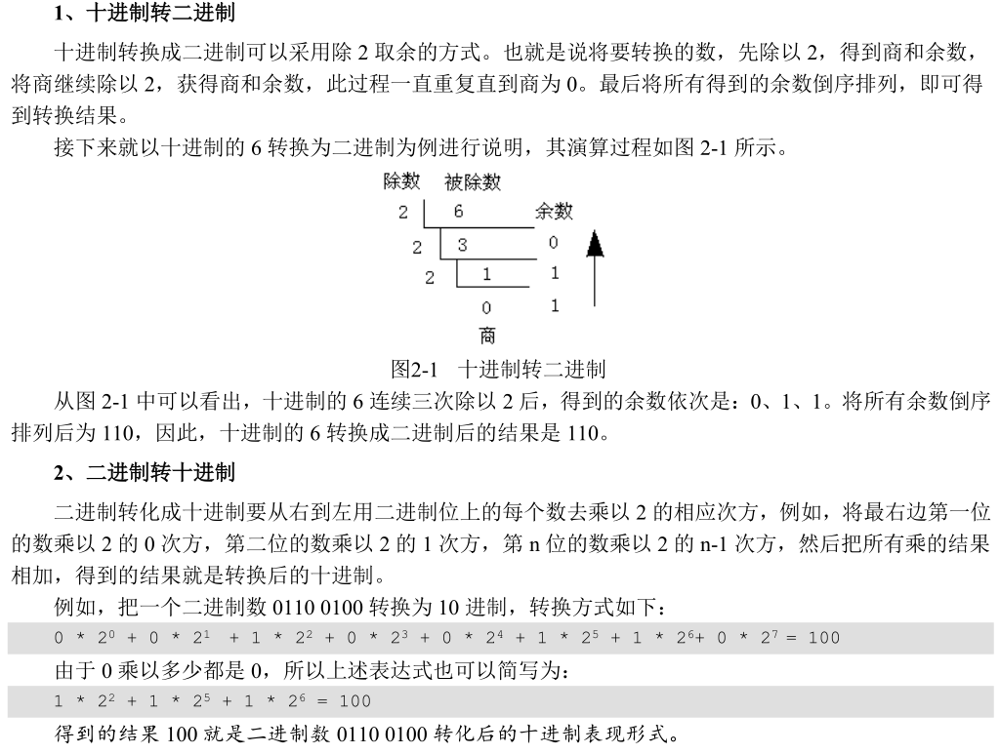
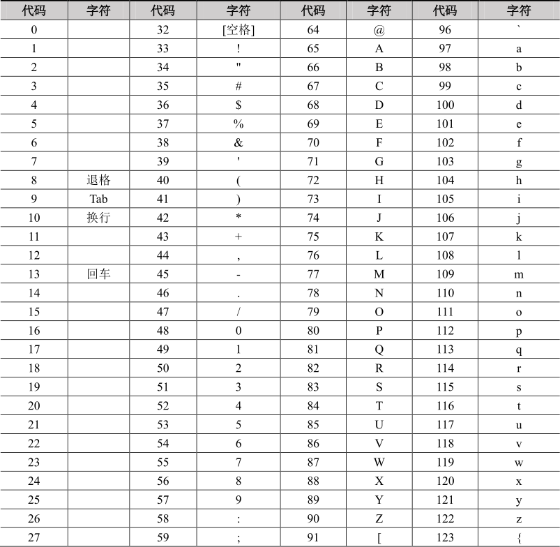
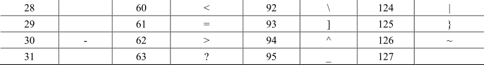
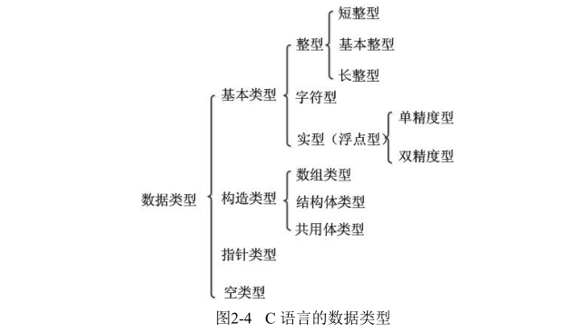
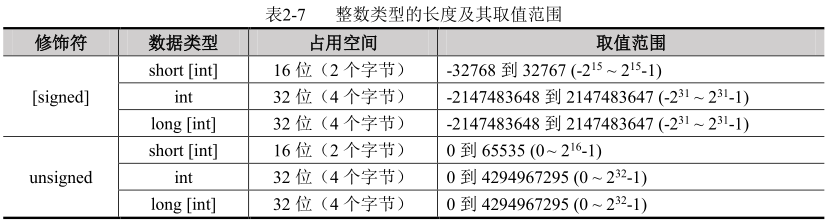
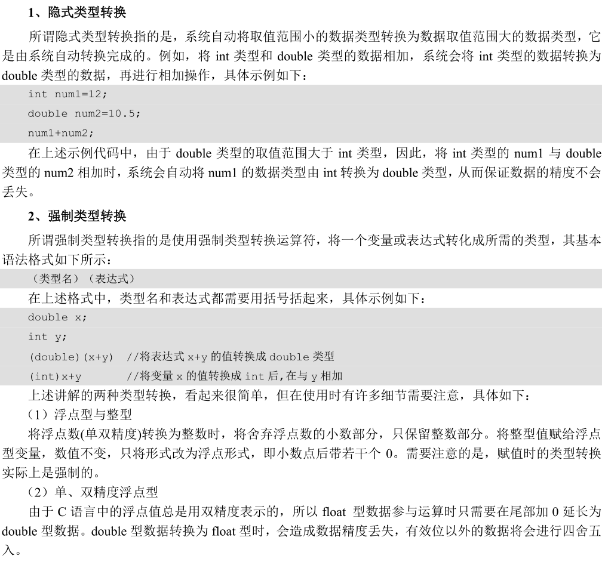
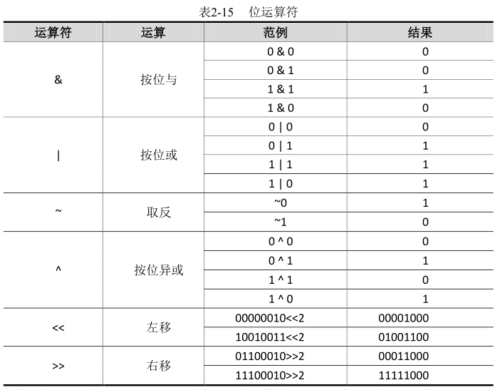
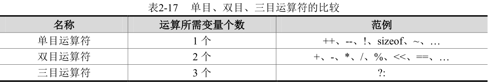

大写的B代表BYTE（字节）， 小写的b代表bit（比特）

表达一个容量的时候，一般用BYTE，表达网络带宽的时候一般用bit

1K = 1024BYTE
1M = 1024K
1G = 1024M
1T = 1024G
十进制	八进制	二进制	十六进制
0	0	000	0
1	1	001	1
2	2	010	2
3	3	011	3
4	4	100	4
5	5	101	5
6	6	110	6
7	7	111	7
8	10	1000	8
9	11	1001	9
10	12	1010	a
11	13	1011	b  
12	14	1100	c
13	15	1101	d
14	16	1110	e
15	17	1111	f
16	20	10000	10
17	21	10001	11

用一个BYTE来表达7
0000 0111   7的原码

用一个WORD来表达7
0000 0000 0000 0111

用一个DWORD来表达7
0000 0000 0000 0000 0000 0000 0000 0111

用一个BYTE来表达-7
1000 0111   -7的原码

用一个WORD来表达-7
1000 0000 0000 0111

用一个DWORD来表达-7
1000 0000 0000 0000 0000 0000 0000 0111

用一个BYTE来表达-7
1111 1000   -7的反码

用一个WORD来表达-7
11111 1111 1111 1000

用一个DWORD来表达-7
1111 1111 1111 1111 1111 1111 1111 1000

用一个BYTE来表达-7
1111 1001   -7的补码

用一个WORD来表达-7
11111 1111 1111 1001

用一个DWORD来表达-7
1111 1111 1111 1111 1111 1111 1111 1001

c语言不规定具体数据类型的大小，所以数据类型实际的大小是和系统息息相关的，在相同的系统下，相同的数据类型大小一定是一样的

除K取余法

ASCII 码表

